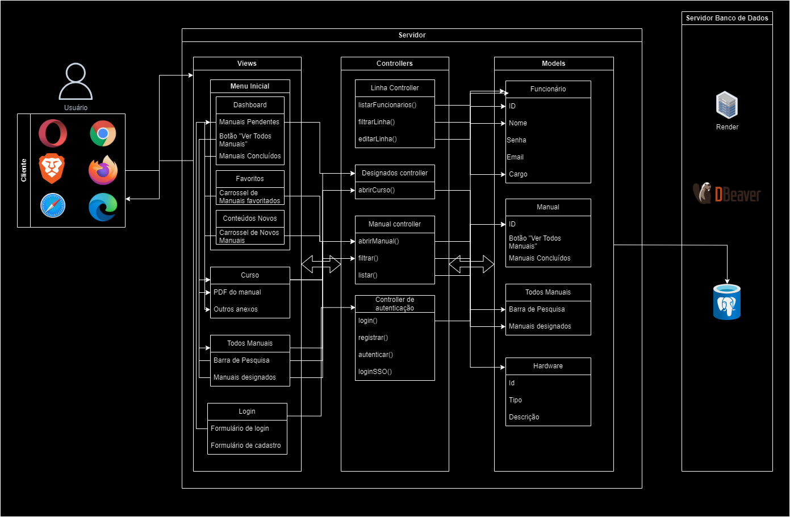

# MVCDell

&nbsp;&nbsp;&nbsp;&nbsp;Edellcation é uma aplicação web desenvolvida com base na estrutura arquitetônica MVC (Model-View-Controller). Este sistema foi concebido para oferecer aos colaboradores das linhas de montagem uma solução abrangente para acessar materiais técnicos e manuais de montagem relacionados aos produtos da empresa, que incluem computadores, servidores e notebooks e seu esboço foi delineado através da plataforma ``Draw.io``.

&nbsp;&nbsp;&nbsp;&nbsp;O diferencial da Edellcation reside na sua capacidade de manter os funcionários constantemente atualizados sobre quaisquer modificações nos procedimentos existentes ou a inclusão de novos manuais. Isso garante uma sincronização contínua com as melhores práticas e as mais recentes diretrizes operacionais da organização, ao mesmo tempo em que oferece um ambiente virtual intuitivo e eficaz para o estudo, revisão e acompanhamento personalizado dos processos de montagem.
 
&nbsp;&nbsp;&nbsp;&nbsp;O padrão MVC, sigla para Model-View-Controller (Modelo-Visão-Controlador), é uma arquitetura de software amplamente utilizada no desenvolvimento de aplicações, especialmente em frameworks web. Ele tem como objetivo separar a lógica de negócios (Model), a apresentação dos dados (View) e a lógica de controle (Controller), proporcionando assim uma estrutura organizada, modular e de fácil manutenção.

***Model* (Modelo)**:
   - O modelo representa a camada de dados da aplicação. Ele é responsável por manipular os dados, realizar operações de armazenamento e recuperação, validar entradas e aplicar regras de negócio.
   - Em um contexto de banco de dados, o modelo frequentemente mapeia os objetos do mundo real para as tabelas do banco de dados e encapsula a lógica para acessar e modificar esses dados.

***View* (Visão)**:
   - A camada de visão é responsável por apresentar os dados ao usuário de uma maneira compreensível e interativa. Ela pode ser uma página HTML, uma interface gráfica de usuário (GUI) ou qualquer outra forma de representação visual dos dados.
   - A visão geralmente recebe dados do modelo e os formata de acordo com as necessidades de exibição. Ela não contém lógica de negócio significativa, limitando-se principalmente a apresentar os dados de forma adequada.

***Controller* (Controlador)**:
   - O controlador atua como intermediário entre a camada de modelo e a camada de visão. Ele recebe as solicitações do usuário, processa essas solicitações, interage com o modelo para obter ou modificar os dados necessários e decide qual visão deve ser renderizada como resposta.
   - O controlador geralmente contém a lógica de negócio relacionada ao fluxo de controle da aplicação, como validação de entrada, decisões de roteamento e manipulação de eventos do usuário.

&nbsp;&nbsp;&nbsp;&nbsp;A separação dessas responsabilidades permite que cada componente do padrão MVC seja desenvolvido, testado e mantido de forma independente, facilitando a escalabilidade e a colaboração entre os membros da equipe de desenvolvimento. Além disso, o MVC promove o princípio de "separação de interesses", o que significa que cada camada tem uma preocupação única e bem definida, tornando o código mais organizado e fácil de entender.

&nbsp;&nbsp;&nbsp;&nbsp;Segue o modelo da arquitetura da edellcation:

MVC
  
Fonte: Material elaborado pelo autor (2024)

&nbsp;&nbsp;&nbsp;&nbsp;Para o desenvolvimento do projeto, optamos por uma arquitetura baseada em Node.js com o framework Sails.js, fundamentada na eficiência e escalabilidade do Node.js para operações intensivas de I/O. O Sails.js foi escolhido por sua robustez e pelas convenções de desenvolvimento que oferece, especialmente adequadas para a criação de APIs RESTful e integração com o banco de dados PostgreSQL.

&nbsp;&nbsp;&nbsp;&nbsp;**PostgreSQL como Sistema de Gerenciamento de Banco de Dados (SGBD):**

&nbsp;&nbsp;&nbsp;&nbsp;A escolha do PostgreSQL como SGBD se justifica pela sua robustez, confiabilidade e capacidade de escalabilidade. Além disso, o PostgreSQL oferece suporte a recursos avançados, como transações ACID (Atomicidade, Consistência, Isolamento e Durabilidade) e índices avançados, que são essenciais para garantir a integridade e a consistência dos dados em ambientes de aplicativos críticos.

&nbsp;&nbsp;&nbsp;&nbsp;**Front-end: HTML5, CSS3, Bootstrap e JavaScript:**

&nbsp;&nbsp;&nbsp;&nbsp;No que diz respeito ao desenvolvimento do front-end, optamos por utilizar as tecnologias HTML5, CSS3, Bootstrap e JavaScript. Essa escolha foi baseada na ampla adoção e familiaridade com essas tecnologias, permitindo a criação de uma interface de usuário intuitiva e responsiva. Além disso, a utilização dessas tecnologias facilita a manutenção e testabilidade do sistema, garantindo uma experiência consistente e agradável para os usuários.

&nbsp;&nbsp;&nbsp;&nbsp;**Node.js com Sails.js:**

&nbsp;&nbsp;&nbsp;&nbsp;A escolha do Node.js com o framework Sails.js para o backend oferece uma estrutura organizada e predefinida para o desenvolvimento de aplicativos web e APIs RESTful. Node.js é ideal para operações de entrada/saída intensivas, enquanto o Sails.js facilita o desenvolvimento ao fornecer convenções e estruturas predefinidas para as operações comuns de uma aplicação web.

&nbsp;&nbsp;&nbsp;&nbsp;**Sistema de Cache:**

&nbsp;&nbsp;&nbsp;&nbsp;A implementação de um sistema de cache é essencial para melhorar o desempenho da aplicação, armazenando conteúdos frequentemente acessados e reduzindo a carga nos servidores. Dentro do padrão MVC, o sistema de cache pode ser considerado uma extensão do Modelo, auxiliando os controladores na recuperação eficiente de dados para apresentação nas Views.

&nbsp;&nbsp;&nbsp;&nbsp;**Serviço de Armazenamento de Arquivos:**

&nbsp;&nbsp;&nbsp;&nbsp;Um serviço de armazenamento de arquivos interno da Dell é empregado para armazenar documentos, imagens, vídeos e outros recursos associados aos cursos da aplicação. Dentro do padrão MVC, esse serviço complementa o Modelo, permitindo o armazenamento e a recuperação de arquivos conforme necessário pelos controladores para apresentação aos usuários.

&nbsp;&nbsp;&nbsp;&nbsp;**API de Single Sign-On (SSO):**

&nbsp;&nbsp;&nbsp;&nbsp;A integração de um sistema de Single Sign-On (SSO) da Dell por meio de uma API possibilita aos usuários autenticarem-se na aplicação usando as credenciais de suas contas corporativas. Essa integração simplifica o processo de login, tornando-o mais conveniente para os usuários. Na arquitetura MVC, essa API desempenha um papel vital no controle de acesso, gerenciando a autenticação dos usuários antes de direcioná-los para as ações apropriadas dos controladores.

&nbsp;&nbsp;&nbsp;&nbsp;**Serviço de Notificações:**

&nbsp;&nbsp;&nbsp;&nbsp;A integração de um serviço de notificações, como o Amazon SES ou Firebase Cloud Messaging, permite o envio de informações relevantes aos usuários sobre atualizações nos cursos e outras atividades pertinentes. Dentro do padrão MVC, esse serviço complementa o fluxo de controle, permitindo que os controladores despachem notificações conforme necessário para os usuários, especialmente quando há atualizações nos materiais do curso.

&nbsp;&nbsp;&nbsp;&nbsp;**Microsserviços e Containers:**
&nbsp;&nbsp;&nbsp;&nbsp;A arquitetura baseada em microsserviços e containers, implementada com tecnologias como Docker e Kubernetes, oferece escalabilidade e flexibilidade à aplicação. Cada microsserviço pode ser considerado uma parte do Modelo ou Controlador, dependendo de sua função na aplicação.